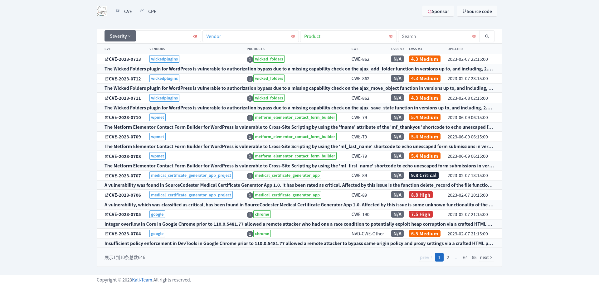
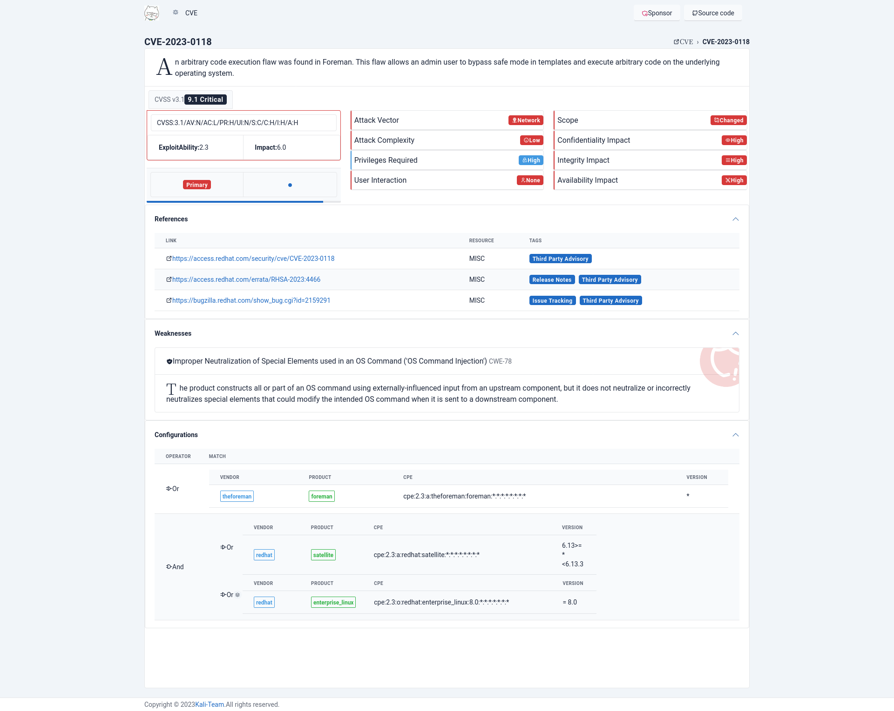
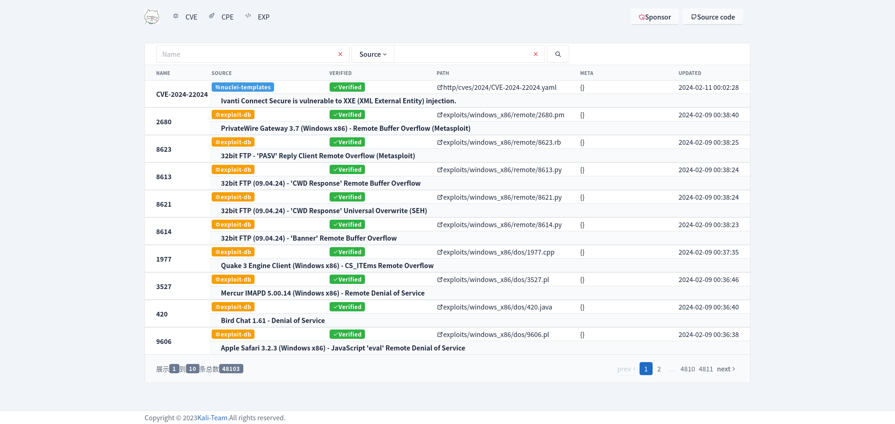

derleme yapılacak bilgisayarda postgresql, openssl kurulu olmalıdır.

1. Ortam değişkenlerine "postgresql" kütüphanesi yolu tanıtılmalıdır.

$env:LIB="C:\Program Files\PostgreSQL\17\lib"
$env:INCLUDE="C:\Program Files\PostgreSQL\17\include"

2. Ortam değişkenlerinde Kullanıcı ve sistem değişkenlerine "postgresql" için bin yolu verilmelidir.
Path altına ekle: C:\Program Files\PostgreSQL\<version>\bin

3. openssl bilgisayara kurulmalıdır.
1. çalıştır: git clone https://github.com/microsoft/vcpkg C:\vcpkg
2. çalıştır: cd C:\vcpkg
3. çalıştır: bootstrap-vcpkg.bat
4. çalıştır: vcpkg install openssl:x64-windows

openssl için ortam değişkenleri
OPENSSL_DIR=C:/vcpkg/installed/x64-windows
OPENSSL_LIB_DIR=C:/vcpkg/installed/x64-windows/lib
OPENSSL_INCLUDE_DIR=C:/vcpkg/installed/x64-windows/include
VCPKGRS_DYNAMIC=1

eğer cmd satırından openssl yazıp çalışmazsa aşağıdaki şekilde environment set etmelisin.

set OPENSSL_DIR=C:\vcpkg\installed\x64-windows
set OPENSSL_STATIC=1

4. UI tarafta build edebilmek için trunk kurmalısın.
1. adım: cargo install trunk
2. adım: trunk --version
3. adım: rustup target add wasm32-unknown-unknown
4. adım: trunk build --release

# scap-rs
---

- A collection of lib for working with [National Vulnerability Database](https://nvd.nist.gov/).

## Libraries

### cvss 通用漏洞评分系统

[![github]](https://github.com/emo-crab/scap-rs)&ensp;[![crates-io]](https://crates.io/crates/nvd-cvss)
&ensp;[![docs-rs]](crate)

[github]: https://img.shields.io/badge/github-8da0cb?style=for-the-badge&labelColor=555555&logo=github

[crates-io]: https://img.shields.io/badge/crates.io-fc8d62?style=for-the-badge&labelColor=555555&logo=rust

[docs-rs]: https://img.shields.io/badge/docs.rs-66c2a5?style=for-the-badge&labelColor=555555&logo=docs.rs

### cve 通用漏洞披露

[![github]](https://github.com/emo-crab/scap-rs)&ensp;[![crates-io]](https://crates.io/crates/nvd-cves)
&ensp;[![docs-rs]](crate)

[github]: https://img.shields.io/badge/github-8da0cb?style=for-the-badge&labelColor=555555&logo=github

[crates-io]: https://img.shields.io/badge/crates.io-fc8d62?style=for-the-badge&labelColor=555555&logo=rust

[docs-rs]: https://img.shields.io/badge/docs.rs-66c2a5?style=for-the-badge&labelColor=555555&logo=docs.rs

### cpe 通用平台枚举

[![github]](https://github.com/emo-crab/scap-rs)&ensp;[![crates-io]](https://crates.io/crates/nvd-cpe)
&ensp;[![docs-rs]](crate)

[github]: https://img.shields.io/badge/github-8da0cb?style=for-the-badge&labelColor=555555&logo=github

[crates-io]: https://img.shields.io/badge/crates.io-fc8d62?style=for-the-badge&labelColor=555555&logo=rust

[docs-rs]: https://img.shields.io/badge/docs.rs-66c2a5?style=for-the-badge&labelColor=555555&logo=docs.rs

### cwe 通用弱点枚举

[![github]](https://github.com/emo-crab/scap-rs)&ensp;[![crates-io]](https://crates.io/crates/nvd-cwe)
&ensp;[![docs-rs]](crate)

[github]: https://img.shields.io/badge/github-8da0cb?style=for-the-badge&labelColor=555555&logo=github

[crates-io]: https://img.shields.io/badge/crates.io-fc8d62?style=for-the-badge&labelColor=555555&logo=rust

[docs-rs]: https://img.shields.io/badge/docs.rs-66c2a5?style=for-the-badge&labelColor=555555&logo=docs.rs

## CVE

## Details

## Exploit

